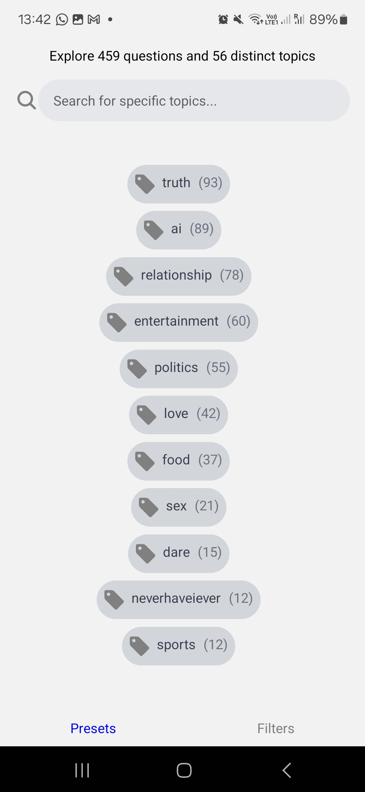

# icebreaker-react-native

## Never run out of things to say

A rewrite of my Icebreaker application in React native (from native android Kotlin)

## Description

Icebreaker is an app allowing you to loop through questions and games in casual conversations, on the dating scene nor with group of friends to easily get conversations going and avoid those awkward silences.

The application gives you random but customized questions and games based on any topics you want (or don't want). 

To have proper customisation, the filters with which you can select which questions come up are called topics, which are precise. They can consist of general aspects (#sport, #relationships, #etc) to set of games (#neverhaveiever, #drinkinggames) or levels of sensitivity of questions (#casual, #deep).

To make it easier for a user to not be overwhelmed, there is a Preset function that gives a more ordained sense by giving more general subjects, which will enable a certain group of topics (Party night will enable topics such as #drinkinggames #neverhaveiever, while presets like "Keep it Casual" will remove sensitive topics like sex or politics) 

This is my first React native application, coming from someone with mostly regular React experience.

## Stack

- React native
- Expo Framework v50
- Nativewind
- Firebase (TODO)

## Implemented Features

- [x] Functional base Expo React Native code
- [x] Base design
- [x] React Native Navigation
- [x] Menu Screen
- [x] Filters Selection Screen
- [x] Question Screen
- [x] Random Question Generation

## Pending Features

- [ ] Presets Selection Screen
- [ ] Dynamic listing of all topics
- [ ] Exclude filters
- [ ] Like and dislike questions / Popularity system
- [ ] Localization Support
- [ ] AI integration for generating questions on the go
- [ ] Deployment to Google Play Store
- [ ] Deployment to iOS Store
- [ ] User data from Google/Apple accounts

Feel free to contribute to this project by implementing pending features or suggesting improvements!
